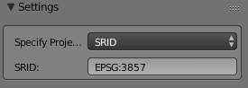

# Blender Map Projection Plugin

This plugin registers a module in the blender python environment which can perform arbitrary Map Projections. The plugin makes use of [pyproj](https://github.com/jswhit/pyproj) in order to perform these projections. To learn more about projections and why the are useful, I encourage you to read [this](http://desktop.arcgis.com/en/arcmap/10.3/guide-books/map-projections/what-are-map-projections.htm#GUID-57EBA564-3106-4CD0-94AB-FA43C1320523).

Pyproj relies upon a binary dependency, [Proj4](http://proj4.org/), requiring this plugin to distribute these binaries. This plugin will attempt to expose these binaries to the embedded python environment.

## Install Procedure

Download the addon from [here](https://github.com/JeremyBYU/bpyproj/releases/download/v1.0.0/bpyproj.zip), install and activate it as an ordinary Blender addon. Follow these [instructions](https://blendersensei.com/definitive-guide-to-installing-blender-addons/) if you have never installed a Blender addon.

This plugin will attempt to automatically install the `pyproj` dependency upon startup. A message will appear in the log if there is any error.

## How to Use

Spatial Reference Identifier (SRID) is a code that tells the plugin which projection system you desire to work with. A list of common SRID's can be found here at [EPSG.io](http://epsg.io/). Simply type in the SRID (e.g. EPSG:3857) into the `SRID` field.

If more granular control is needed you can change the drop down menu (`Specify Projection`) from `SRID` to `Proj4 Params`. You can now input the Proj.4 parameter string directly in the field titled `Proj4 Parameters`.

## Bpyproj for Addon Developers
Read the dedicated wiki [page](https://github.com/JeremyBYU/bpyproj/wiki/bpyproj-for-addon-developers).
